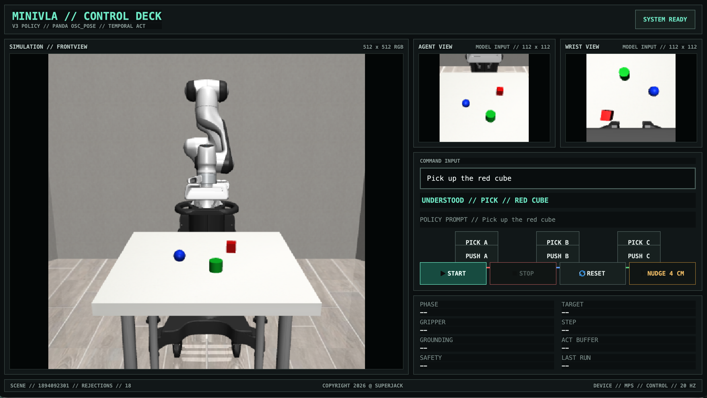
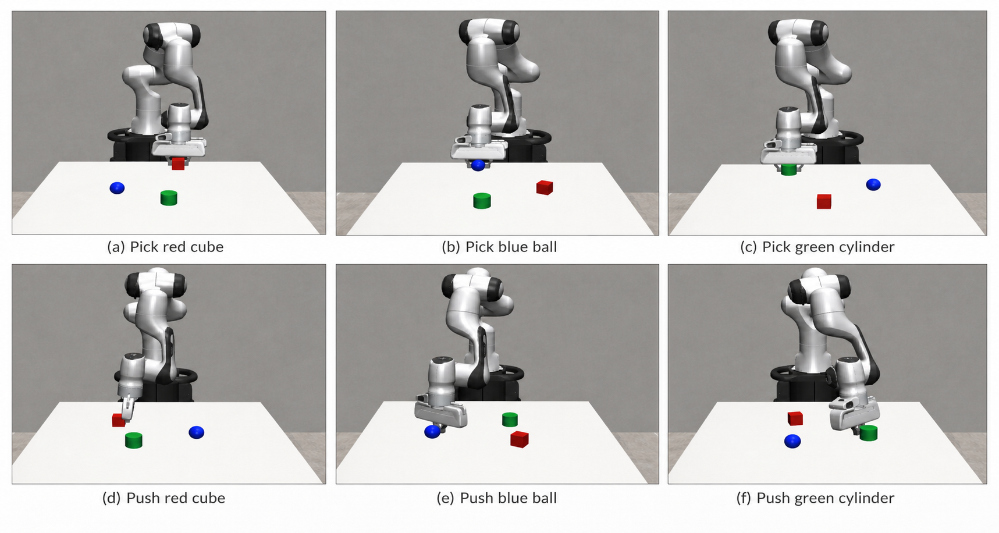
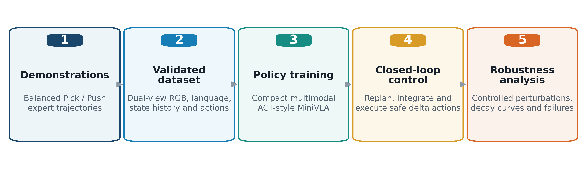
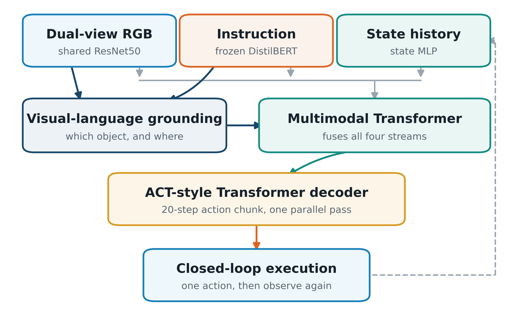
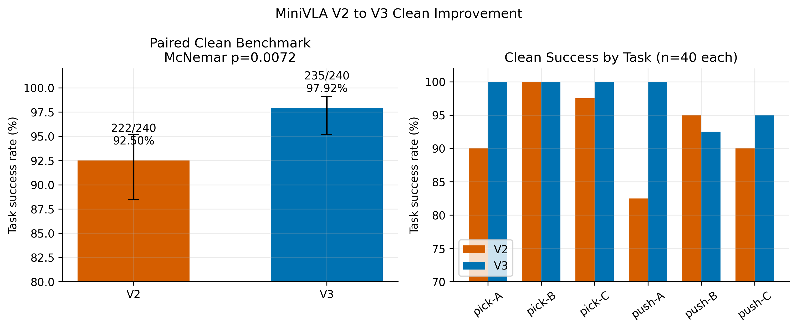
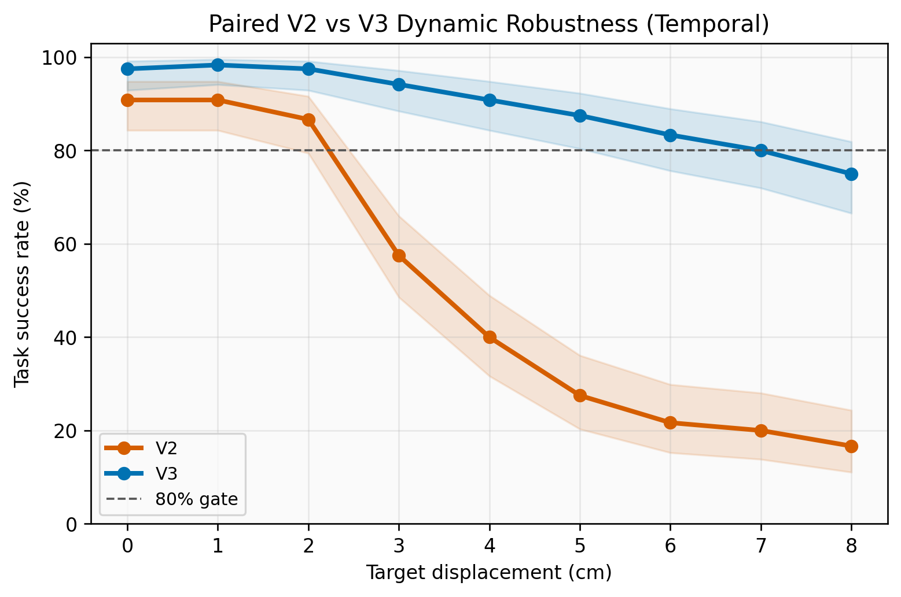
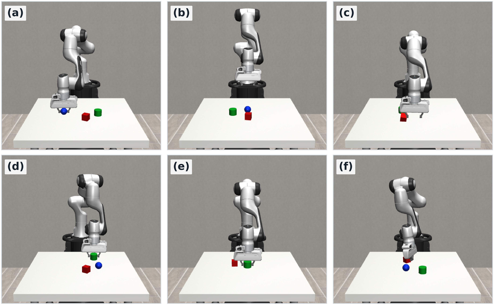

<div align="center">
  

  <h1>MiniVLA V3</h1>
  <p><strong>Failure-Aware Robustness Evaluation of a Compact Vision-Language-Action Policy for Simulated Robotic Manipulation</strong></p>
  <p><em>A compact vision-language-action policy, a reproducible perturbation benchmark, and a failure taxonomy for explaining how manipulation policies break.</em></p>

  <p>
    
    
    
    
    
  </p>

  <p>
    <a href="#project-overview"><strong>Overview</strong></a> |
    <a href="#system-architecture"><strong>Architecture</strong></a> |
    <a href="#verified-results"><strong>Results</strong></a> |
    <a href="#quick-start"><strong>Quick Start</strong></a> |
    <a href="#robustness-benchmarks"><strong>Benchmarks</strong></a> |
    <a href="#repository-map"><strong>Repository</strong></a>
  </p>
</div>

---

## Project Overview

A robot policy is often summarized by one success rate measured under one set
of conditions. That number says whether something failed, but not which stage
failed, why it failed, or how quickly performance decays as the environment
changes.

This project addresses that gap with an end-to-end simulated manipulation
pipeline:

1. Collect balanced, recovery-aware expert demonstrations.
2. Train a dual-view, language-conditioned MiniVLA policy.
3. Execute 7D delta pose actions in closed loop with temporal ensembling.
4. Inject controlled visual, physical, geometric, linguistic, and dynamic
   perturbations into paired scenes.
5. Record task success together with grounding, contact, grasp, recovery,
   safety, and failure-stage evidence.

The final MiniVLA V3 policy controls a Panda arm in MuJoCo / robosuite across
six tasks: **pick** or **push** a red cube, blue ball, or green cylinder.

<p align="center">
  
</p>

### Verified Snapshot

| Item | Frozen result |
| --- | ---: |
| V3 paired Clean success | **235 / 240 (97.92%)** |
| V2 paired Clean success | 222 / 240 (92.50%) |
| Paired Clean McNemar test | **p = 0.0072** |
| V3 success after 4 cm target displacement | **90.83%** |
| V2 success after 4 cm target displacement | 40.00% |
| Held-out language success | **170 / 180 (94.44%)** |
| Formal closed-loop episode records | **12,240** across eight experiment families |

All values above are simulation results from the frozen artifacts and formal
paired protocols in [`final_report/`](final_report/README.md). They are not
real-robot or sim-to-real claims.

## Core Engineering Philosophy

### Paired Conditions, Not Unmatched Averages

Every perturbation level reuses the same base scene, task, target, and seed as
its clean control. This isolates the perturbation instead of mixing its effect
with easier or harder random scenes.

### Raw Policy Execution

The evaluator does not use simulator object coordinates to correct policy
actions. Privileged state is restricted to scene construction, perturbation
injection, scoring, and post-hoc diagnosis. The policy acts from language,
pixels, and proprioceptive history.

### Failure Stage Before Failure Count

Success is only the first metric. The evaluator also distinguishes failures
such as target not reached, wrong-object contact, missed grasp, object drop,
insufficient lift, lateral push error, and insufficient push distance.

## Evaluation Pipeline

<p align="center">
  
</p>

| Stage | What happens |
| --- | --- |
| Demonstrations | A scripted closed-loop oracle produces balanced Pick / Push trajectories and explicit recovery behavior. |
| Validated dataset | Dual-view RGB, language, 17D state, 7D action, phase, contact, grasp, and target labels are checked against a strict schema. |
| Policy training | MiniVLA learns action chunks plus auxiliary grounding and interaction signals. |
| Closed-loop control | The policy replans every control step, temporally integrates recent predictions, clips unsafe commands, and executes one 7D delta action. |
| Robustness analysis | Matched perturbations produce decay curves, paired statistics, recovery metrics, and failure taxonomies. |

## System Architecture

<p align="center">
  
</p>

### Inputs

- **Language:** raw task instruction encoded by a frozen
  `distilbert-base-uncased` model.
- **Global vision:** 112 x 112 `agentview` RGB frame.
- **Wrist vision:** 112 x 112 `robot0_eye_in_hand` RGB frame.
- **State:** five causal steps of 17D robot proprioception.

### Multimodal Policy

- Shared ImageNet-pretrained ResNet50 visual backbone with GroupNorm.
- Learned spatial tokens from both camera views.
- Frozen DistilBERT language features and a learned projection layer.
- State-history MLP and temporal embeddings.
- Multimodal Transformer encoder plus an ACT-style Transformer decoder.
- Auxiliary target grounding, target-class, phase, contact, and grasp heads.

### Outputs and Control

The policy predicts a 20-step action chunk. Each action is a 7D `OSC_POSE`
delta command:

```text
[delta_x, delta_y, delta_z, delta_roll, delta_pitch, delta_yaw, gripper]
```

At runtime the evaluator replans after every observation, combines compatible
predictions from recent chunks, executes one bounded action, and observes the
scene again. robosuite's operational-space controller converts the desired
end-effector delta pose into robot joint torques; the learned policy therefore
does not directly predict seven Panda joint angles.

### Frozen V3 Configuration

| Component | Configuration |
| --- | --- |
| Architecture | `MiniVLAV2`, architecture version 4 |
| Hidden dimension | 512 |
| Transformer | 2 encoder layers, 3 decoder layers, 8 heads |
| Action chunk | 20 steps |
| Total parameters | 101,784,921 |
| Trainable parameters | 33,977,113 |
| Language model | Frozen DistilBERT |
| Controller | Panda `OSC_POSE`, 20 Hz, 7D delta action |

## Data and Training

The V3 corpus keeps the proven V2 Clean demonstrations and adds a separate
recovery set rather than silently relabeling old trajectories:

| Dataset | Episodes | Purpose |
| --- | ---: | --- |
| V2 Clean | 1,200, balanced 200 per task | Stable six-task manipulation behavior |
| V3 Recovery | 600, balanced 100 per task | Forced approach misses and 2-4 cm target displacement recovery |
| Combined corpus | 1,800 | V3 training, validation, and held-out evaluation |

Each task has 60 training expressions and 30 disjoint evaluation-only
expressions. Visual augmentation is physically conservative: color and small
translation changes are allowed, while horizontal flips and arbitrary
rotations are excluded because they would corrupt left/right geometry.

The canonical data contract and loader are implemented in
[`utils/v2_schema.py`](utils/v2_schema.py) and
[`utils/training_dataset_v2.py`](utils/training_dataset_v2.py). Training entry
points and audit gates are documented in
[`docs/runbooks/V3_RUNBOOK.md`](docs/runbooks/V3_RUNBOOK.md).

## Verified Results

### V3 Improves the Clean Baseline

<p align="center">
  
</p>

Across two paired seeds, V3 improved from 92.50% to 97.92%. The exact paired
McNemar test gives `p = 0.0072`, so the improvement is not explained by simply
sampling a different set of scenes.

### V3 Reacquires Dynamically Displaced Targets

<p align="center">
  
</p>

At 4 cm displacement, V3 retained 90.83% success while V2 fell to 40.00%. At
8 cm, V3 remained at 75.00% and V2 at 16.67%. The benchmark records injection
phase, actual displacement, reacquisition rate and latency, recovery cost,
wrong contact, and final failure category.

### Failure-Aware Evaluation

<p align="center">
  
</p>

The project separates task selection from task completion. A policy can
confidently execute the wrong operation, contact the wrong object, reach the
right object but miss the grasp, or complete the interaction without moving
the object far enough. Those outcomes require different fixes and should not
be collapsed into one generic `Fail` label.

## Robustness Benchmarks

The formal suite characterizes V3 across eight experiment families:

| Family | Controlled variable | Main output |
| --- | --- | --- |
| Paired Clean | V2 versus V3 on identical scenes | Baseline gain and paired significance |
| Dynamic displacement | Target teleportation from 0 to 8 cm | Tracking decay and reacquisition |
| Visual degradation | Brightness, Gaussian noise, Gaussian blur | Perceptual failure boundaries |
| Physics drift | Target mass / inertia and contact friction | Pick / Push sensitivity |
| Camera extrinsics | Camera translation and rotation | Calibration robustness |
| OOD distractors | Zero to three unseen geometric distractors | Wrong contact and target selection |
| Language generalization | Canonical versus held-out paraphrases | Task confusion and semantic retention |
| ACT chunk ablation | Chunk sizes 1, 5, 10, and 20 | Smoothness / responsiveness trade-off |

Publication-ready figures and analysis summaries are indexed in
[`final_report/`](final_report/README.md); episode-level CSV / JSON evidence is
stored under [`results/benchmarks/`](results/benchmarks/).

### Example: Paired Dynamic Displacement Benchmark

```bash
PYTHONUNBUFFERED=1 conda run --no-capture-output -n mujoco310 \
  python scripts/benchmark_robustness_v2.py \
    --policy artifacts/v3-clean-rc1/mini_vla_v3_policy.pth \
    --perturbation target-displacement \
    --levels 0 0.02 0.04 0.06 0.08 \
    --episodes-per-level 120 \
    --ensemble-modes temporal latest-only \
    --temporal-profile robust \
    --local-files-only \
    --output-dir results/robustness/target_displacement
```

## Interactive Control Deck

The macOS desktop interface provides a 512 x 512 human view, the exact two
112 x 112 policy camera streams, free-text command input, six deterministic
task shortcuts, reset / stop controls, and an interactive 4 cm target nudge.
The simulator runs in a spawned child process so MuJoCo's OpenGL context stays
on the correct macOS process thread.

The UI command resolver is a demonstration convenience. Formal held-out
language tests bypass it and send raw text directly to DistilBERT.

## Quick Start

### 1. Clone and Retrieve the Frozen Policy

The 135 MB policy is stored with Git LFS.

```bash
git clone https://github.com/SuperJack0228/VLA-Robustness-Eval.git
cd VLA-Robustness-Eval
git lfs install
git lfs pull
```

### 2. Create the macOS Environment

```bash
conda create -n mujoco310 python=3.10 -y
conda activate mujoco310
python -m pip install -r requirements.txt
```

The frozen DistilBERT files must either exist in the local Hugging Face cache
or be downloaded once before using `--local-files-only`.

### 3. Launch the Interactive Demo

```bash
env -u MUJOCO_GL \
  PYTHONUNBUFFERED=1 \
  conda run --no-capture-output -n mujoco310 \
  python scripts/launch_demo_v3.py
```

### 4. Run One Explicit Language-Conditioned Episode

Use straight ASCII quotes in the terminal:

```bash
env -u MUJOCO_GL \
  PYTHONUNBUFFERED=1 \
  conda run --no-capture-output -n mujoco310 \
  python scripts/evaluate_policy_v2.py \
    --policy artifacts/v3-clean-rc1/mini_vla_v3_policy.pth \
    --num-episodes 1 \
    --max-steps 200 \
    --instruction "Pick up the red cube" \
    --task-type pick \
    --target-id A \
    --render \
    --replan-interval 1 \
    --ensemble-mode temporal \
    --temporal-profile robust \
    --visual-perturbation clean \
    --local-files-only \
    --output-prefix results/manual_language_demo
```

`--task-type` and `--target-id` tell the simulator which scene to construct and
how to score it. They do not replace the text received by the policy.

### 5. Run the Regression Suite

```bash
env -u MUJOCO_GL \
  conda run --no-capture-output -n mujoco310 \
  python -m pytest -q
```

For NVIDIA CUDA, MuJoCo EGL, Slurm submission, and artifact retrieval, follow
[`hpc/HPC_RUNBOOK.md`](hpc/HPC_RUNBOOK.md).

## Repository Map

```text
VLA-Robustness-Eval/
├── artifacts/                  Frozen policies, statistics, logs, provenance
│   ├── v2-clean-rc1/
│   ├── v3-clean-rc1/
│   └── chunk-ablation-v3/
├── configs/                    Language augmentation catalogs
├── data/                       Local demonstration archives and manifests
├── docs/
│   ├── history/                V2-to-V3 engineering history
│   ├── images/readme/          GitHub-safe README figures
│   ├── runbooks/               V2, V3, release, and execution guides
│   └── presentations/          Stage presentation artifacts
├── final_report/               Paper-ready figures, tables, and analyses
├── hpc/                        Cognition HPC setup and Slurm workflows
├── models/                     MiniVLA V2/V3 architecture
├── results/benchmarks/         Raw episode-level evaluation evidence
├── scripts/                    Collection, training, evaluation, benchmarks
├── ui/                         PySide6 MiniVLA Control Deck
├── utils/                      Schema, datasets, evaluation, perturbations
└── tests/                      Regression and protocol tests
```

### Important Entry Points

| File | Responsibility |
| --- | --- |
| [`models/mini_vla_v2.py`](models/mini_vla_v2.py) | Authoritative V2 / V3 multimodal ACT architecture |
| [`scripts/collect_data_v2.py`](scripts/collect_data_v2.py) | Balanced Clean scripted-oracle collector |
| [`scripts/collect_data_v3.py`](scripts/collect_data_v3.py) | Recovery and dynamic-target data collector |
| [`scripts/train_v3.py`](scripts/train_v3.py) | V2 Clean plus V3 Recovery training pipeline |
| [`utils/evaluation_core_v2.py`](utils/evaluation_core_v2.py) | Closed-loop inference, safety, scoring, and taxonomy |
| [`utils/perturbations_v2.py`](utils/perturbations_v2.py) | Lifecycle-based perturbation injection |
| [`scripts/evaluate_policy_v2.py`](scripts/evaluate_policy_v2.py) | Clean and visual closed-loop evaluator CLI |
| [`scripts/benchmark_robustness_v2.py`](scripts/benchmark_robustness_v2.py) | Paired dynamic-displacement benchmark |
| [`scripts/launch_demo_v3.py`](scripts/launch_demo_v3.py) | Interactive desktop application entry point |

## Reproducibility and Artifact Integrity

- Frozen V3 policy, normalization statistics, training logs, metadata, and
  checksums: [`artifacts/v3-clean-rc1/`](artifacts/v3-clean-rc1/README.md)
- V3 release identity and evidence boundary:
  [`docs/runbooks/V3_RELEASE_MANIFEST.md`](docs/runbooks/V3_RELEASE_MANIFEST.md)
- Complete V3 workflow: [`docs/runbooks/V3_RUNBOOK.md`](docs/runbooks/V3_RUNBOOK.md)
- Engineering evolution and failed-experiment record:
  [`docs/history/V2_EVOLUTION.md`](docs/history/V2_EVOLUTION.md)

Verify the frozen release files with:

```bash
cd artifacts/v3-clean-rc1
shasum -a 256 -c SHA256SUMS
```

## Scope

This repository evaluates a simulated Panda manipulation policy. It does not
claim real-robot deployment, sim-to-real transfer, open-world language
understanding, or safety certification. Its contribution is a reproducible,
failure-aware method for measuring where a compact VLA policy remains reliable
and where it begins to fail.

## Project Author

**Yining Liu**<br>
MSc Robotics & AI, James Watt School of Engineering, University of Glasgow

---

<div align="center">
  <strong>From one success rate to a measurable map of robustness and failure.</strong>
</div>
